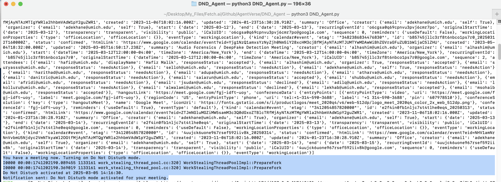
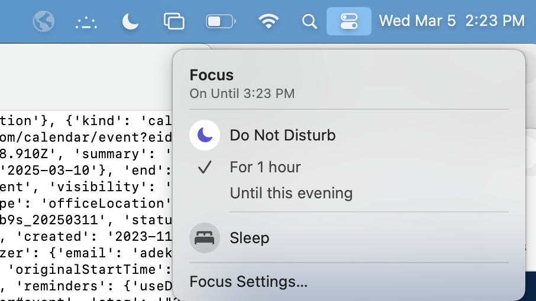
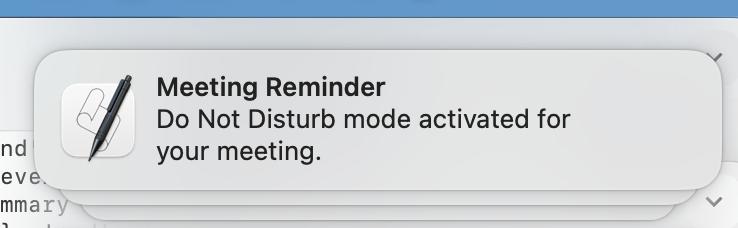
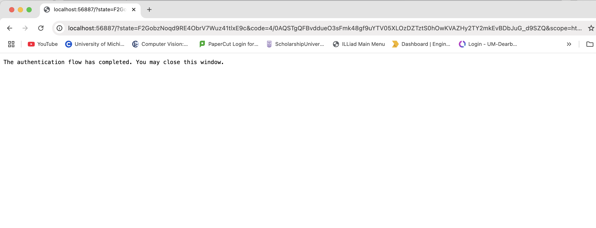

  
  

# Do Not Disturb Agent

## Description
This project is a smart automation agent that integrates with Google Calendar to automatically enable or disable macOS Do Not Disturb mode based on scheduled meetings. It ensures a distraction-free environment during active meetings by muting notifications.

## Input Data Model
The input is fetched from Google Calendar API, requiring authorization and an access token.

```python
SCOPES = ['https://www.googleapis.com/auth/calendar.readonly']
```

## Output Data Model
The agent triggers system-level changes in macOS to toggle Do Not Disturb mode and sends system notifications.

```python
def set_do_not_disturb(enabled):
    command = f"defaults -currentHost write com.apple.notificationcenterui doNotDisturb -boolean {'true' if enabled else 'false'}"
    subprocess.run(command, shell=True)
    subprocess.run("killall NotificationCenter", shell=True)
```

## Features
- Automatically detects scheduled meetings from Google Calendar.
- Enables Do Not Disturb mode during meetings.
- Displays system notifications about mode activation.
- Runs continuously in the background, checking every 60 seconds.

## Screenshots
### Terminal Output


### Do Not Disturb Mode On


### Notification in Bar


### Authentication of Calender


## Dependencies
- Python 3.x
- `uagents`
- `google-auth-oauthlib`
- `google-auth-httplib2`
- `google-auth`
- `googleapiclient`

## Installation
1. Clone this repository:
    ```sh
    git clone https://github.com/fetchai/innovation-lab/tree/main/AishwaryaDekhane/DND_Schedular_Agent/do-not-disturb-agent.git
    cd do-not-disturb-agent
    ```
2. Install dependencies:
    ```sh
    pip install -r requirements.txt
    ```
3. Setup Google Calendar API credentials:
    - Obtain `credentials.json` from Google Cloud Console.
    - Place it in the project directory.

## Functions
- **get_calendar_service()**: Authenticates and connects to Google Calendar API.
- **check_schedule(service)**: Checks upcoming events and toggles Do Not Disturb mode.
- **set_do_not_disturb(enabled)**: Modifies macOS notification settings.
- **display_notification(message)**: Displays system notifications.
- **startup_handler(ctx)**: Initializes the agent on startup.

## Usage
1. Run the agent:
    ```sh
    python dnd_agent.py
    ```
2. The agent will monitor Google Calendar and toggle Do Not Disturb mode accordingly.
3. View logs in the terminal for debugging information.

## Author
Aishwarya Dekhane


