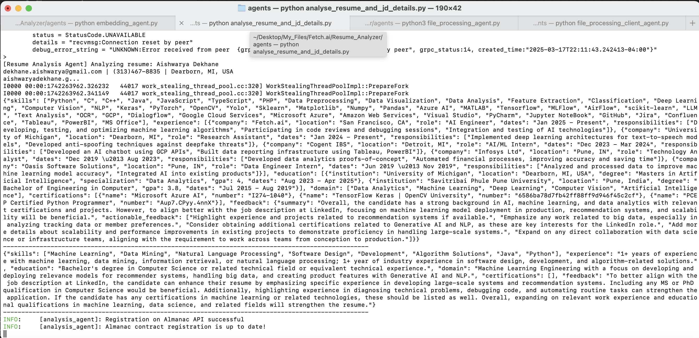

## Agent Name: Feedback_&_Analysis_Agent

## Description
The `analysis_agent` evaluates resumes against a job description by analyzing readability, grammar, keyword relevance, and linguistic scores. It determines compatibility based on keyword matching and provides insights on readability metrics and missing keywords.

## Input Data Model
The agent expects input data in the form of a `ResumeAnalysisRequest` model:

```python
class ResumeAnalysisRequest(Model):
    resumes: list
    job_description: str
```

## Output Data Model
The agent responds with resume analysis and compatibility results using the `ResumeAnalysisResponse` model:

```python
class ResumeAnalysisResponse(Model):
    analysis_results: dict
    compatibility: dict
```

## Screenshots
Here are some screenshots demonstrating the functionality of My Agent:
   

## Features
- Computes multiple readability scores:
  - Flesch Reading Ease
  - Gunning Fog Index
  - Dale-Chall Readability Score
  - SMOG Index
  - Automated Readability Index
  - Coleman-Liau Index
- Checks grammar issues using `language_tool_python`.
- Extracts and compares keywords between resumes and job descriptions.
- Computes linguistic scores and identifies missing keywords.
- Determines compatibility based on keyword matching.

## Dependencies
The project requires the following dependencies:
- `uagents`
- `textstat`
- `language_tool_python`
- `re`
- `collections`

## Installation
To install the required dependencies, run:

```sh
pip install uagents textstat language-tool-python
```

## Screenshots
### Terminal Output


## Functions

### `extract_keywords(text) -> Counter`
Extracts keywords from text and returns their frequency count.

### `calculate_compatibility(resume_keywords, job_keywords) -> float`
Computes the compatibility score based on common keywords between resumes and job descriptions.

### `handle_analysis(ctx: Context, sender: str, request: ResumeAnalysisRequest)`
Handles resume analysis by:
- Calculating readability scores.
- Identifying grammar issues and providing feedback.
- Extracting and comparing keywords.
- Determining linguistic and compatibility scores.
- Sending results to the requesting agent.

## Usage
1. Ensure the required dependencies are installed.
2. Start the agent by running:

   ```sh
   python analysis_agent.py
   ```

3. The agent listens for incoming resume analysis requests and responds with detailed analysis and compatibility results.

## Author
Aishwarya Dekhane

