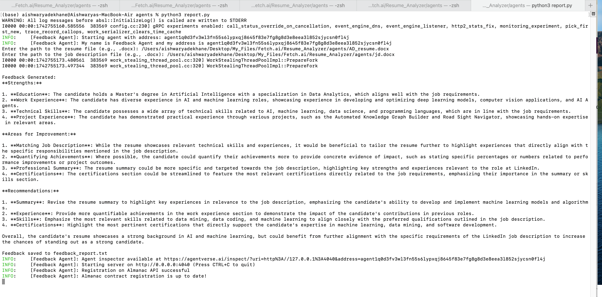
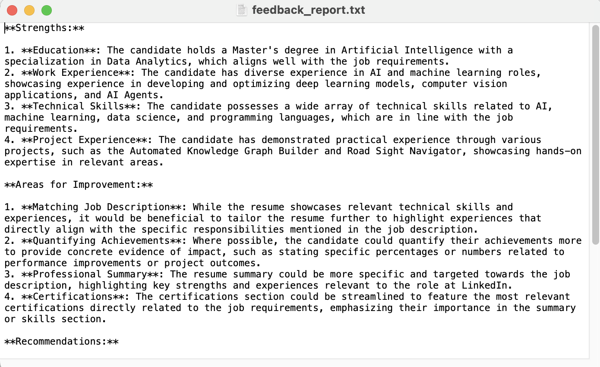

# Feedback Agent - Resume and Job Description Analysis

## Overview
The **Feedback Agent** is a Python-based agent designed to analyze a resume against a job description. It uses OpenAI's `gpt-3.5-turbo` model to generate constructive feedback, highlighting the strengths, weaknesses, and areas for improvement in the resume relative to the job description. The generated feedback is saved in a `feedback_report.txt` file and displayed in the terminal for the user's convenience.

## Features
- Reads `.docx` files for both the resume and the job description.
- Compares the resume against the job description using OpenAI's GPT model.
- Provides feedback on strengths, weaknesses, and areas for improvement.
- Saves the feedback to a `feedback_report.txt` file.
- Displays the feedback in the terminal.

## Requirements
- Python 3.x
- OpenAI API Key
- Required libraries:
  - `openai`
  - `python-docx`
  - `uagents`

## Screenshots
Here are some screenshots demonstrating the functionality of My Agent:
   
   

## Installation

1. **Clone or download the repository**:
   ```bash
   git clone https://github.com/your-repository/feedback-agent.git
   ```

2. **Install the dependencies**:
   Ensure that Python 3.x is installed, and then use `pip` to install the necessary packages:
   ```bash
   pip install openai python-docx uagents
   ```

3. **Set your OpenAI API key**:
   Replace `'your_openai_api_key'` with your actual OpenAI API key in the script.

## Usage

1. **Running the Agent**:
   After setting up the environment and ensuring the OpenAI API key is correctly configured, run the script using:
   ```bash
   python feedback_agent.py
   ```

2. **Input the paths to the resume and job description**:
   Once the script starts, you will be prompted to enter the file paths for the resume and job description (both in `.docx` format).
   ```
   Enter the path to the resume file (e.g., .docx): /path/to/resume.docx
   Enter the path to the job description file (e.g., .docx): /path/to/job_description.docx
   ```

3. **Feedback Output**:
   The agent will compare the resume with the job description, generate feedback, and:
   - Display the feedback in the terminal.
   - Save the feedback to a `feedback_report.txt` file in the current working directory.

## Example

```bash
Enter the path to the resume file (e.g., .docx): /path/to/resume.docx
Enter the path to the job description file (e.g., .docx): /path/to/job_description.docx

Feedback Generated:
The resume shows a strong background in Python programming, with extensive experience in software development. However, the job description emphasizes project management skills, which seem to be missing in the resume. Adding relevant project management experience could improve the match.

Feedback saved to feedback_report.txt
```

## File Structure

```
feedback-agent/
│
├── feedback_agent.py        # The main script for running the agent
├── feedback_report.txt      # The file where feedback will be saved
├── README.md                # This readme file
└── requirements.txt         # List of required Python dependencies
```

## Notes
- Ensure that your `.docx` files are properly formatted for best results.
- The OpenAI API may have usage limits depending on your subscription, so be mindful of any rate limits or quotas when using the agent.

## Author
Aishwarya Dekhane

