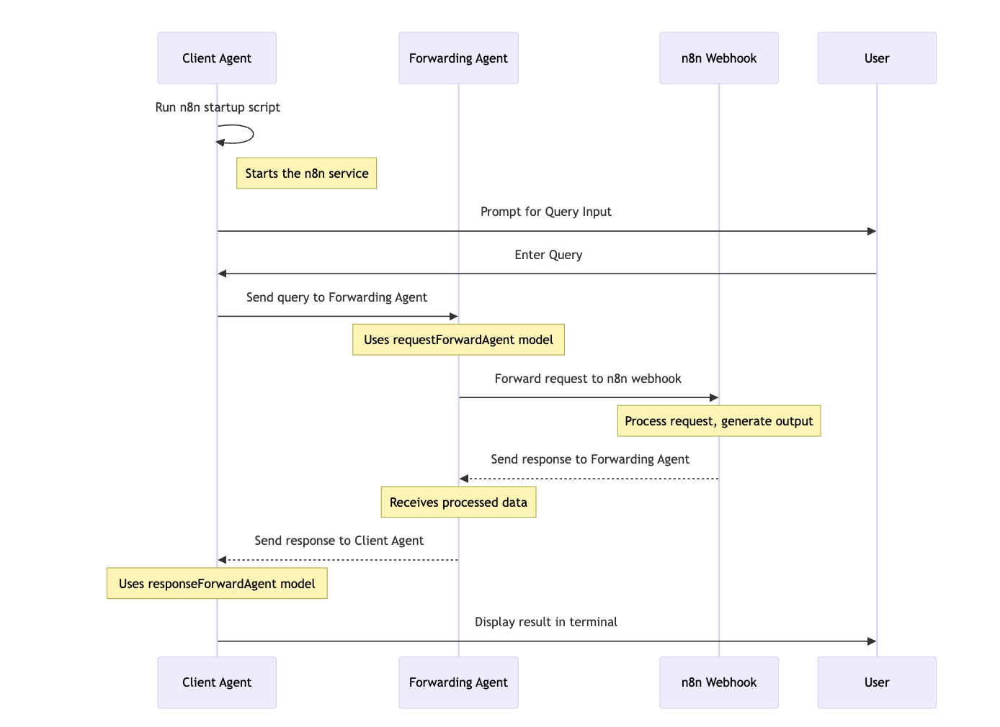

  
  

# Communicating with n8n Applications Using Fetch.ai

This guide provides instructions on how to integrate Fetch.ai with n8n to automate and facilitate data exchange between decentralized AI agents and workflow automation processes.

## Overview

Fetch.ai agents can be used to send and receive data to and from n8n workflows, enabling complex automations and integrations. This setup allows Fetch.ai agents to interact with various applications connected through n8n, leveraging its broad integration capabilities.

## Prerequisites

- **n8n Instance:** Ensure you have an operational n8n instance available, either hosted or running locally.
- **Fetch.ai SDK:** Set up your development environment with Fetch.ai tools and libraries.

## Steps to Set Up Communication

### 1. Setup Webhook in n8n

1. **Create a Webhook Node:**
   - In your n8n dashboard, create a new workflow.
   - Add a "Webhook" trigger node and configure it:
     - **HTTP Method:** Select POST to handle incoming requests.
     - **Path:** Define a unique path for your webhook (e.g., `/fetch-ai`).

2. **Save and Activate the Workflow:**
   - Ensure the workflow is saved and activate it to start receiving requests.

3. **Copy the Webhook URL:**
   - The URL will look something like `https://your-n8n-instance/webhook/fetch-ai`.
   - This is where your Fetch.ai agent will send data.

### 2. Configure Fetch.ai Agent

1. **Install Fetch.ai Framework:**
   - Follow Fetch.ai's installation guide to set up your development environment.
   - Use pip to install necessary packages:
     ```bash
     pip install fetchai-sdk
     ```

2. **Create an Agent:**
   - Develop an agent using Fetch.ai SDK that constructs and sends HTTP requests.
   - Use Python’s `requests` library or similar to interact with the n8n webhook:
   ```python
   import requests

   class N8nAgent:
       def __init__(self, webhook_url):
           self.webhook_url = webhook_url

       def send_data_to_n8n(self, data):
           response = requests.post(self.webhook_url, json=data)
           return response.json()

   # Sample usage
   n8n_agent = N8nAgent("https://your-n8n-instance/webhook/fetch-ai")
   data_to_send = {"key": "value"}
   response = n8n_agent.send_data_to_n8n(data_to_send)
   print(response)
   ```

3. **Receive Data in Fetch.ai:**
   - Set up your agent to handle responses from n8n. This might involve creating endpoints within your Fetch.ai system to process responses from n8n workflows.

### 3. Testing Communication

1. **Simulate a Fetch.ai to n8n Interaction:**
   - Run your Fetch.ai agent script to send test data to the n8n webhook.
   - Monitor n8n to ensure the workflow is triggered and processes the data.

2. **Validate the Output:**
   - Check that the response from n8n is correctly handled by the Fetch.ai agent.

## Screenshots
### Integration Flow


## Considerations

- **Security:** Ensure data transfer between Fetch.ai and n8n is secured via HTTPS, and consider implementing authentication where necessary.
- **Error Handling:** Implement error detection and retries in your Fetch.ai agent to handle temporary failures in sending or receiving data.
- **Scalability:** Plan your architecture to allow scaling of agents or workflows as your application grows.

## Conclusion

By setting up communication between Fetch.ai and n8n, you can automate processes that engage AI agent capabilities in analyzing, processing, and routing tasks across various applications integrated with n8n. This facilitates sophisticated automation scenarios that can improve efficiency and effectiveness in managing workflows.

## Author
Aishwarya Dekhane

