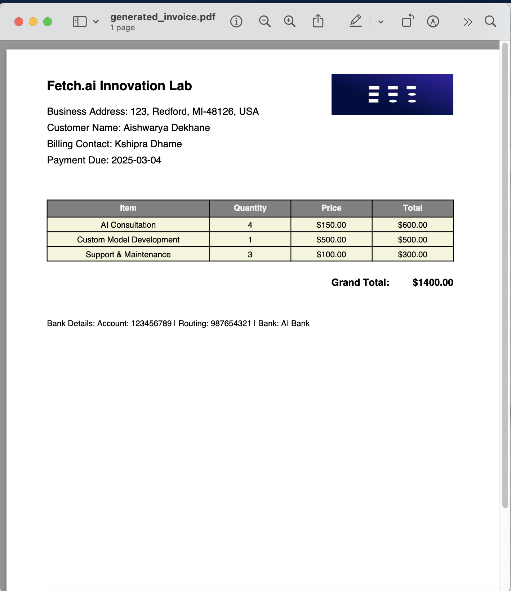

# Invoice Generator


## Description
This project is an Invoice Generator that allows users to input invoice details and generates a professional PDF invoice with a structured table layout.

## Input Data Model
The expected input data includes information such as item description, quantity, unit price, and any additional charges. Input class model code snippet:
```python
class InvoiceInput:
    def __init__(self, item_description, quantity, unit_price, additional_charges):
        self.item_description = item_description
        self.quantity = quantity
        self.unit_price = unit_price
        self.additional_charges = additional_charges
```

## Output Data Model
The output data format is a PDF invoice document containing the structured details of the invoice items, quantities, prices, and the total amount. Output class model code snippet:
```python
class InvoiceOutput:
    def __init__(self, invoice_data):
        self.invoice_data = invoice_data
```

## Screenshots
Here are some screenshots demonstrating the functionality of My Agent:

 1. **Enter Your Data** - Kindly add your data to generate invoices. Refer below screenshot if you need help in how to add data.
   

 2. **Invoice** - Here is the sample invoice. 
      

## Features
- User-friendly terminal interface for entering invoice details.
- Automatic calculation of total amount based on input data.
- Generation of professional PDF invoices with a table layout.

## Dependencies
- pandas
- letter
- canvas
- colors
- Table
- TableStyle
- os

## Installation
1. Install the required dependencies by running:
```
pip install pandas letter canvas colors reportlab
```
2. Ensure the necessary imports are present at the top of the `.py` file.

## Functions
- __init__(self) -> Unknown: Initialize the invoice generator with user input.
- get_user_input(self) -> Unknown: Collects invoice details from user via the terminal.
- prepare_invoice_data(self) -> Unknown: Converts user input into a DataFrame and ensures the 'Total' column is calculated.
- generate_pdf(self, output_filename) -> Unknown: Generates a PDF invoice from the structured data with a professional table layout.

## Usage
To use the Invoice Generator:
1. Run the program and follow the prompts to enter the invoice details.
2. Once all details are provided, the program will generate a PDF invoice file with the entered information.

## Author
Aishwarya Dekhane
