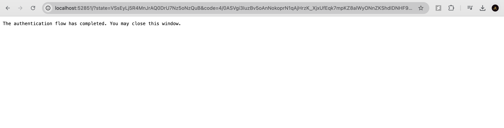
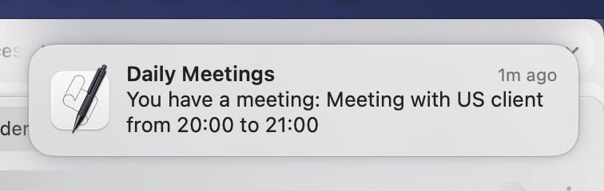
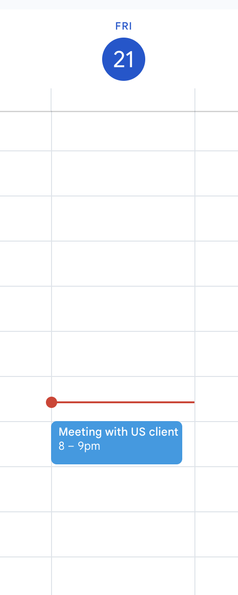
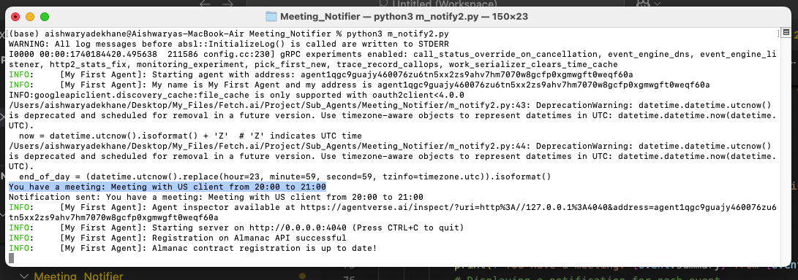

# My Meeting Nofitier Agent

## Overview
My Meeting Nofitier Agent is an AI-driven assistant that retrieves Google Calendar events and sends notifications about daily meetings. It is built using `uagents` and integrates with the Google Calendar API.

## Input Data Model
The agent processes events using the following data model:
```python
class Event(Model):
    summary: str
    start: datetime
    end: datetime
```
This model represents a calendar event with a title (`summary`), start time (`start`), and end time (`end`).

## Output Data Model
The agent retrieves events from Google Calendar and presents them as a list of `Event` objects. Additionally, it sends notifications for upcoming meetings using system alerts.

## Features
- Fetches upcoming meetings from Google Calendar.
- Converts calendar events into structured data.
- Displays system notifications for scheduled meetings.
- Runs as an autonomous agent using the `uagents` framework.

## Authentication Requirement
Users must provide authentication credentials by placing a valid `credentials.json` file in the root directory. This file is necessary to access the Google Calendar API.

## Installation
1. Clone this repository:
   ```bash
   git clone <repository-url>
   cd <repository-name>
   ```
2. Install dependencies:
   ```bash
   pip install -r requirements.txt
   ```
3. Authenticate Google Calendar API:
   - Obtain `credentials.json` from Google API Console.
   - Place it in the root directory of the project.
   - Run the script once to authenticate and generate `token.pickle`.

## Usage
Run the agent using:
```bash
python script.py
```
Upon startup, the agent will fetch your calendar events and send notifications about your meetings.

## Screenshots
Here are some screenshots demonstrating the functionality of My First Agent:

1. **Fetching Calendar Events** - The agent retrieves events from Google Calendar.
   

2. **Displaying Retrieved Events** - The agent lists the meetings for the day.
   

3. **Sending Notifications** - System notifications pop up for upcoming meetings.
   

4. **Agent Running in Terminal** - The agent runs continuously, monitoring for events.
   

## Configuration
- Modify `SCOPES` to adjust the level of access to Google Calendar.
- Change `endpoint` and `port` in `my_mNotify_agent` for different hosting configurations.

## Created By
Aishwarya Dekhane

