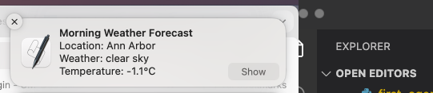

# My Weather Notifier Agent

## Overview
My First Agent is an AI-driven assistant that fetches weather information and sends notifications about the current weather conditions. It is built using `uagents` and integrates with the OpenWeatherMap API.

## Input Data Model
The agent processes weather data using the following model:
```python
class Message(Model):
    message: str
```
This model represents a message containing weather details.

## Output Data Model
The agent fetches weather details and returns them in a formatted string, including:
- **Location**: Name of the city.
- **Weather**: Description of the weather conditions.
- **Temperature**: Current temperature in Celsius.
- **Error Handling**: If an error occurs, an appropriate message is returned.

## Screenshots
Here are some screenshots demonstrating the functionality of My First Agent:

1. **Notification** - Weather Notification in side bar in morning.
   

2. **Terminal** - Notification on Terminal.
   

## Features
- Fetches real-time weather data from OpenWeatherMap.
- Displays system notifications with the weather update.
- Runs as an autonomous agent using the `uagents` framework.

## Authentication Requirement
Users must provide an API key from OpenWeatherMap. Replace `api_key` in the script with a valid key. You can obtain an API key from [OpenWeatherMap API](https://home.openweathermap.org/api_keys).

## Installation
1. Clone this repository:
   ```bash
   git clone <repository-url>
   cd <repository-name>
   ```
2. Install dependencies:
   ```bash
   pip install -r requirements.txt
   ```
3. Set up OpenWeatherMap API key:
   - Obtain an API key from OpenWeatherMap.
   - Replace `api_key` in the script with your key.

## Usage
Run the agent using:
```bash
python script.py
```
Upon startup, the agent will fetch weather data for the default city (`Ann Arbor`) and display a system notification.

## Configuration
- Modify `city` in `get_weather(api_key, city)` to fetch weather for a different location.
- Change `endpoint` and `port` in `my_first_agent` for different hosting configurations.

## Created By
Aishwarya Dekhane

