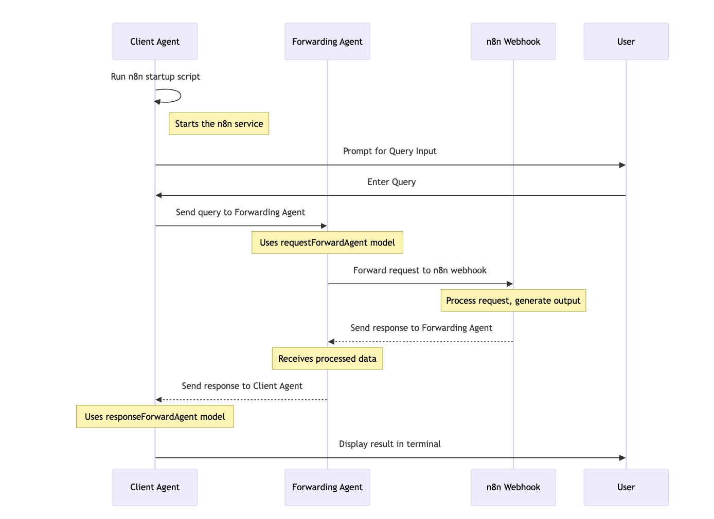
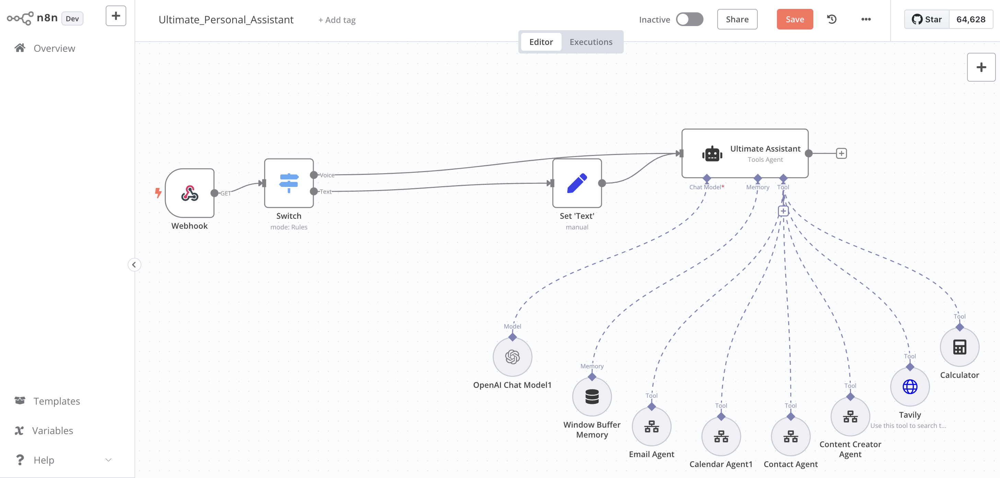
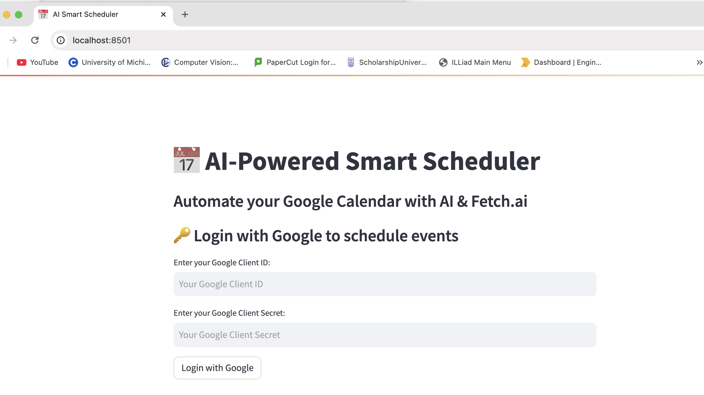

# Project Name: Personal Assistant

 

## Description
This project serves as a trial client agent that acts as an intermediary between the user interface and backend processing systems. It manages user requests, interacts with backend processors, and optimizes data transactions to support automation and efficient workflows.

## Input Data Model
The project expects input data in a JSON format encapsulated within a predefined class structure. Below is a short snippet of the input class model code:

```python
class UserInput:
    def __init__(self, query: str, timestamp: str):
        self.query = query
        self.timestamp = timestamp
```

## Output Data Model
The project generates output data in a structured format, designed to communicate processed results back to the user interface. Below is a short snippet of the output class model code:

```python
class ProcessedOutput:
    def __init__(self, result: dict, status: str):
        self.result = result
        self.status = status
```

## Features
- Communicates with the user interface to gather and send data.
- Processes input queries and forwards them to backend systems.
- Receives and interprets data from n8n workflows to return processed results.

## Dependencies
- json
- subprocess
- time
- Agent
- Context
- Model

## Installation
To run the project, follow these steps:
1. Ensure you have Python installed.
2. Install the required dependencies mentioned above using pip:
   ```bash
   pip install json subprocess time
   ```
   Note: You might need to replace 'Agent', 'Context', and 'Model' with their relevant package names if they're external dependencies.
3. Verify all necessary packages are installed and accessible from your Python environment.

## Screenshots

1. **Project Flow Diagram:** 


2. **n8n Flow:** 


3. **UI:** 


## Functions

### prepare_query
Sets the global USER QUERY variable.

Parameters:
- `usr_query` (str): The incoming user query

```python
def prepare_query(usr_query: str) -> None:
    # Function implementation here
```

## Usage
To use the project effectively, launch the main script. It will wait for input from the UI, process it through the second agent (via n8n workflows), and display the results to the UI. The configuration file must be adjusted to point to the n8n instance.

```bash
python main.py
```

## Author
Aishwarya Dekhane