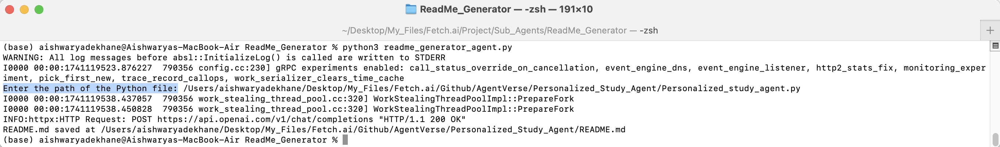

# README Generator Agent


## Agent Name
`readme_generator_agent`

## Description
This project aims to generate README.md files for other projects by utilizing the OpenAI API for content creation.

## Input Data Model
The expected input data format consists of a Python file that needs its documentation to be generated. Below is a short code snippet depicting the input class model:
```python
class InputData:
    file_path: str
```

## Output Data Model
The output data format is a generated README.md file. Below is a short code snippet describing the output class model:
```python
class OutputData:
    readme_content: str
```
## Screenshots
Here are some screenshots demonstrating the functionality of My Agent:

**Enter File Name** - Enter path of your code for which you want to generate readme file.
   

## Features
- Extracts classes, functions, docstrings, and dependencies from a given Python file.
- Utilizes the OpenAI API to dynamically generate README.md content.

## Dependencies
The project requires the following dependencies:
- os
- ast
- openai
- Agent
- Context
- Model

## Installation
To install the dependencies and run the project, ensure you have the necessary packages installed. Check the imports at the top of the `.py` file and install the required packages accordingly.

## Functions
- `extract_code_details(file_path) -> dict`: Extracts classes, functions, docstrings, and dependencies from the given Python file.
- `generate_readme(file_path) -> str`: Generates a README.md file using the OpenAI API.

## Usage
To use the project, follow these steps:
1. Execute the `extract_code_details(file_path)` function to extract code details from a Python file.
2. Use the `generate_readme(file_path)` function to generate a README.md file based on the extracted information.

## Author
Aishwarya Dekhane
