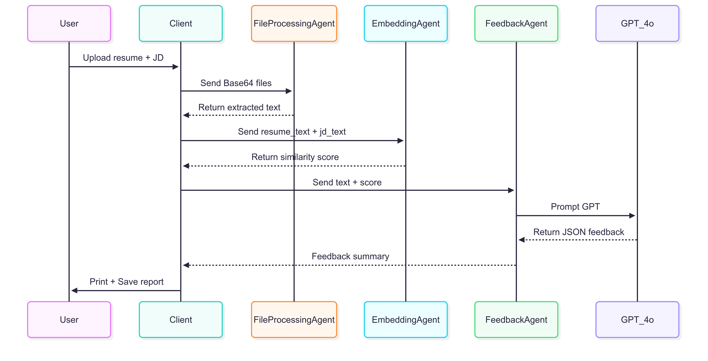

Resume Analyzer & Feedback Generation System 🚀

A fully-modular, multi-agent platform that screens résumés against a Job Description (JD), ranks candidates by cosine similarity, and generates GPT-4-powered feedback reports – all orchestrated with Fetch.ai’s uAgents framework.

⸻

📚 Table of Contents
	1.	Overview
	2.	Key Features
	3.	Architecture
	•	Data Flow
	•	Agents
	4.	Project Structure
	5.	Quick Start
	6.	Usage Examples
	7.	Configuration
	8.	API Schema
	9.	Development Setup
	10.	Roadmap
	11.	Contributing
	12.	License

⸻

Overview

The Resume Analyzer ingests one or more résumés and a target Job Description, then:
	1.	Extracts and cleans text from PDF/DOCX/TXT files.
	2.	Generates embeddings via OpenAI text-embedding-3-small.
	3.	Calculates cosine similarity scores to rank candidates.
	4.	Creates a structured feedback report using GPT-4o, highlighting skill gaps, keyword matches, and section-by-section advice.
	5.	Outputs JSON + human-readable summaries for downstream dashboards (Streamlit, React) or Siri Shortcuts.

Everything runs asynchronously through uAgents, allowing each micro-service to scale or swap models independently.

⸻

Key Features
	•	🔌 Pluggable Agents – swap embedding models or LLMs without touching other components.
	•	⚡ Batch Mode – rank dozens of résumés in a single run (WIP).
	•	📝 GPT-Structured Feedback – machine-readable JSON plus a concise summary.
	•	🗂️ File-Type Agnostic – automatic PDF/DOCX/TXT parsing.
	•	🎨 Streamlit / React Dashboard Ready – front-end hooks baked in.
	•	🗣️ Voice Integration – expose endpoints for Siri Shortcuts.

⸻

Architecture

Data Flow

graph TD;
  A[User] -->|Base-64 Résumé + JD| B(FileProcessingAgent);
  B -->|Clean Text| C(EmbeddingAgent);
  C -->|Vectors + Scores| D(FeedbackAgent);
  D -->|JSON Feedback| E[Client / UI];

Agents

Agent	File	Purpose
FileProcessingAgent	file_processing_agent.py	Detect MIME, extract & clean text
EmbeddingAgent	embedding_agent.py	Generate embeddings & compute cosine similarity
FeedbackAgent	feeback_agent.py	GPT-4o feedback & report writer
LinguisticAnalysisAgent (optional)	LinguisticAnalysisAgentServer.py	Readability & grammar scores
Client	file_processing_client_agent.py	CLI/orchestrator

⸻

Project Structure

├── README.md
├── assets/
│   └── architecture.png
├── requirements.txt
├── file_processing_agent.py
├── embedding_agent.py
├── feeback_agent.py  # typo kept for historical consistency 🤖
├── LinguisticAnalysisAgentServer.py
├── file_processing_client_agent.py
└── tests/
    └── ...

⸻

Quick Start

Prerequisites: Python ≥3.10, OPENAI_API_KEY environment variable.

# 1. Clone & install
$ git clone https://github.com/YOUR_USER/YOUR_REPO.git
$ cd YOUR_REPO
$ pip install -r requirements.txt

# 2. Launch agents (each in its own terminal or tmux pane)
$ python file_processing_agent.py
$ python embedding_agent.py
$ python feeback_agent.py

# 3. Run the demo client
$ python file_processing_client_agent.py --resume path/to/resume.pdf --jd path/to/jd.txt

The client prints similarity scores and writes feedback_report_<candidate>.txt to disk.

⸻

Usage Examples

CLI (Single Résumé)

python file_processing_client_agent.py \
    --resume ./resumes/Alex.pdf \
    --jd ./jd/backend_ml_engineer.txt

Batch Mode (Multiple Résumés)

python file_processing_client_agent.py \
    --resume ./resumes/*.pdf \
    --jd ./jd/backend_ml_engineer.txt \
    --top 5

Sample JSON Output

{
  "candidate": "Alex.pdf",
  "similarity": 0.82,
  "gpt_feedback": {
    "overall_fit": "Strong",
    "skill_gaps": ["Kubernetes", "Time-series forecasting"],
    "section_advice": {
      "Summary": "Highlight your experience with micro-services…",
      "Experience": "Quantify ML model latency reductions…"
    }
  }
}

⸻

Configuration

Set these env vars (e.g., in .env):

OPENAI_API_KEY=sk-...
TIMEOUT_SECONDS=30
EMBEDDING_MODEL=text-embedding-3-small
LLM_MODEL=gpt-4o

⸻

API Schema (Future HTTP Wrapper)

POST /analyze
Content-Type: application/json
{
  "resumes": ["<base64>"],
  "job_description": "<base64>"
}

Returns 200 OK with JSON structure shown above.

⸻

Development Setup

# Run linting & tests
$ pip install pre-commit
$ pre-commit install
$ pytest -q

Hot-reloading during development:

$ pip install watchfiles
$ watchfiles 'python embedding_agent.py'

⸻

Roadmap
	•	🗃️ Database Persistence – store embeddings & feedback for fast re-runs
	•	📊 Streamlit Dashboard – charts & interactive résumé explorer
	•	🗣️ Siri Shortcut Integration – voice-triggered analysis on iOS
	•	🌐 OAuth-Secured REST API for external integration
	•	📝 Automated Unit & Load Tests in CI

⸻
## 🧩 System Architecture

-----
Contributing
	1.	Fork the repo & create your branch:

git checkout -b feature/my-awesome-feature

	2.	Commit your changes & run tests.
	3.	Push to the branch and open a Pull Request.

Thank You to the Developer.
Ms. Aishwarya Dekhane

⸻
