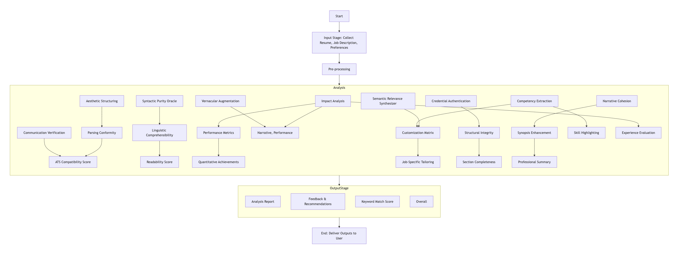

# Resume Analyzer & Feedback Generation System 🚀

A fully-modular, multi-agent platform that screens résumés against a Job Description (JD), ranks candidates by cosine similarity, and generates GPT-4-powered feedback reports – all orchestrated with Fetch.ai’s uAgents framework.

---

## 📚 Table of Contents

1. [Overview](#overview)
2. [Key Features](#key-features)
3. [Architecture](#architecture)

   * [Data Flow](#data-flow)
   * [Agents](#agents)
4. [Project Structure](#project-structure)
5. [Quick Start](#quick-start)
6. [Usage Examples](#usage-examples)
7. [Configuration](#configuration)
8. [API Schema](#api-schema)
9. [Development Setup](#development-setup)
10. [Roadmap](#roadmap)
11. [Contributing](#contributing)
12. [License](#license)

---

## Overview

The Resume Analyzer ingests one or more résumés and a target Job Description, then:

1. Extracts and cleans text from PDF/DOCX/TXT files.
2. Generates embeddings via OpenAI `text-embedding-3-small`.
3. Calculates cosine similarity scores to rank candidates.
4. Creates a structured feedback report using GPT-4o, highlighting skill gaps, keyword matches, and section-by-section advice.
5. Outputs JSON + human-readable summaries for downstream dashboards (Streamlit, React) or Siri Shortcuts.

Everything runs asynchronously through uAgents, allowing each micro-service to scale or swap models independently.

---

## Key Features

* 🔌 **Pluggable Agents** – swap embedding models or LLMs without touching other components.
* ⚡ **Batch Mode** – rank dozens of résumés in a single run (WIP).
* 📝 **GPT-Structured Feedback** – machine-readable JSON plus a concise summary.
* 🗂️ **File-Type Agnostic** – automatic PDF/DOCX/TXT parsing.
* 🎨 **Streamlit / React Dashboard Ready** – front-end hooks baked in.
* 🗣️ **Voice Integration** – expose endpoints for Siri Shortcuts.

---

## Architecture

### Data Flow

```mermaid
flowchart TD
  A[User] -->|Base-64 Résumé + JD| B(FileProcessingAgent)
  B -->|Clean Text| C(EmbeddingAgent)
  C -->|Vectors + Scores| D(FeedbackAgent)
  D -->|JSON Feedback| E[Client / UI]
```



### Agents

| Agent                              | File                               | Purpose                                         |
| ---------------------------------- | ---------------------------------- | ----------------------------------------------- |
| FileProcessingAgent                | file\_processing\_agent.py         | Detect MIME, extract & clean text               |
| EmbeddingAgent                     | embedding\_agent.py                | Generate embeddings & compute cosine similarity |
| FeedbackAgent                      | feeback\_agent.py                  | GPT-4o feedback & report writer                 |
| LinguisticAnalysisAgent (optional) | LinguisticAnalysisAgentServer.py   | Readability & grammar scores                    |
| Client                             | file\_processing\_client\_agent.py | CLI/orchestrator                                |

---

## Project Structure

```
├── README.md
├── assets/
│   └── architecture.png
├── requirements.txt
├── file_processing_agent.py
├── embedding_agent.py
├── feeback_agent.py  # typo kept for historical consistency 🤖
├── LinguisticAnalysisAgentServer.py
├── file_processing_client_agent.py
└── tests/
    └── ...
```

---

## Quick Start

**Prerequisites:** Python ≥3.10, `OPENAI_API_KEY` environment variable.

```bash
# 1. Clone & install
$ git clone https://github.com/YOUR_USER/YOUR_REPO.git
$ cd YOUR_REPO
$ pip install -r requirements.txt

# 2. Launch agents (each in its own terminal or tmux pane)
$ python file_processing_agent.py
$ python embedding_agent.py
$ python feeback_agent.py

# 3. Run the demo client
$ python file_processing_client_agent.py --resume path/to/resume.pdf --jd path/to/jd.txt
```

The client prints similarity scores and writes `feedback_report_<candidate>.txt` to disk.

---

## Usage Examples

### CLI (Single Résumé)

```bash
python file_processing_client_agent.py \
    --resume ./resumes/Alex.pdf \
    --jd ./jd/backend_ml_engineer.txt
```

### Batch Mode (Multiple Résumés)

```bash
python file_processing_client_agent.py \
    --resume ./resumes/*.pdf \
    --jd ./jd/backend_ml_engineer.txt \
    --top 5
```

### Sample JSON Output

```json
{
  "candidate": "Alex.pdf",
  "similarity": 0.82,
  "gpt_feedback": {
    "overall_fit": "Strong",
    "skill_gaps": ["Kubernetes", "Time-series forecasting"],
    "section_advice": {
      "Summary": "Highlight your experience with micro-services…",
      "Experience": "Quantify ML model latency reductions…"
    }
  }
}
```

---

## Configuration

Set these env vars (e.g., in `.env`):

```env
OPENAI_API_KEY=sk-...
TIMEOUT_SECONDS=30
EMBEDDING_MODEL=text-embedding-3-small
LLM_MODEL=gpt-4o
```

---

## API Schema (Future HTTP Wrapper)

```http
POST /analyze
Content-Type: application/json
{
  "resumes": ["<base64>"],
  "job_description": "<base64>"
}
```

Returns `200 OK` with JSON structure shown above.

---

## Development Setup

```bash
# Run linting & tests
$ pip install pre-commit
$ pre-commit install
$ pytest -q
```

**Hot-reloading during development:**

```bash
$ pip install watchfiles
$ watchfiles 'python embedding_agent.py'
```

---

## Roadmap

* 🗓️ **Database Persistence** – store embeddings & feedback for fast re-runs
* 📊 **Streamlit Dashboard** – charts & interactive résumé explorer
* 🗣️ **Siri Shortcut Integration** – voice-triggered analysis on iOS
* 🌐 **OAuth-Secured REST API** for external integration
* 📝 **Automated Unit & Load Tests** in CI

---

## Sequence Diagram


## DataFlow Diagram


---

## Contributing

1. Fork the repo & create your branch:
2. Commit your changes & run tests.
3. Push to the branch and open a Pull Request.

Thank You to the Developer.
**Ms. Aishwarya Dekhane**

---

## License

Distributed under the **MIT License**. See `LICENSE` for more information.
