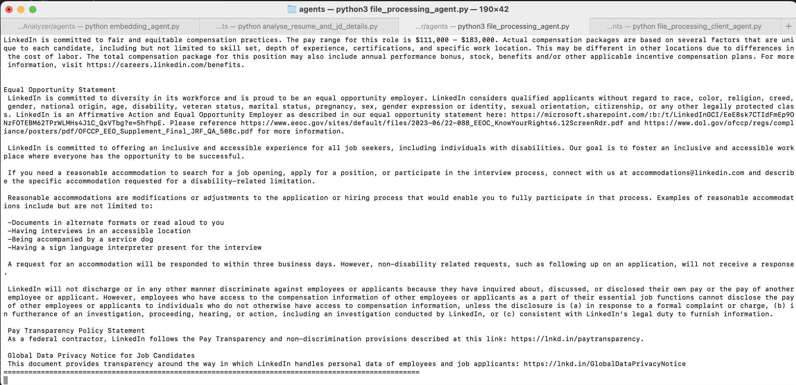

# Agent Name: Resume_File_Processing_Agent

## Description
The `file_processing_agent` extracts text from resumes and job descriptions in `.docx` and `.pdf` formats (PDF support is currently commented out). It then forwards the extracted text to an analysis agent for further processing.

## Input Data Model
The agent expects input data in the form of a `FileProcessingRequest` model:

```python
class FileProcessingRequest(Model):
    file_content: str  # Base64-encoded file content
    file_type: str
    job_description: str
    jd_type: str
```

## Output Data Model
The agent responds with extracted text and forwards it to the analysis agent using the `FileProcessingResponse` model:

```python
class FileProcessingResponse(Model):
    extracted_text: str
    similarity: float
```

## Features
- Extracts text from `.docx` and `.pdf` files (PDF extraction currently commented out).
- Uses base64 encoding/decoding for file transmission.
- Handles unsupported file types gracefully.
- Forwards extracted resume and job description text to the analysis agent.

## Dependencies
The project requires the following dependencies:
- `uagents`
- `docx`
- `base64`
- `tempfile`
- `os`
- `starlette`

## Installation
To install the required dependencies, run:

```sh
pip install uagents python-docx starlette
```

## Screenshots
Here are some screenshot demonstrating the functionality of My Agent:
   

## Functions

### `extract_text_from_docx(content) -> str`
Extracts text from a `.docx` file.

### `handle_file_processing(ctx: Context, sender: str, request: FileProcessingRequest)`
- Decodes base64 file content.
- Extracts text from supported file formats.
- Logs extracted job description and resume text.
- Sends processed text to the analysis agent for further evaluation.

## Usage
1. Ensure the required dependencies are installed.
2. Start the agent by running:

   ```sh
   python file_processing_agent.py
   ```

3. The agent listens for file processing requests and forwards extracted text to the analysis agent.

## Author
Aishwarya Dekhane

